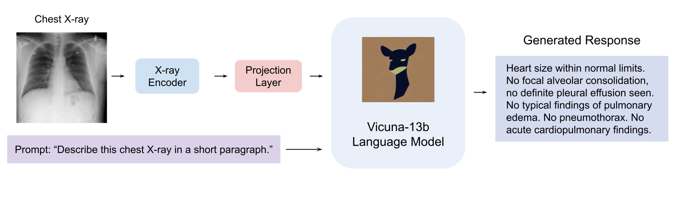

# XrayChat: Towards Enabling ChatGPT-Like Capabilities on Chest X-ray Images

This repository holds the code and data of XrayChat: Towards Enabling ChatGPT-Like Capabilities on Chest X-ray Images.

## Technical report will be available soon. 


## Introduction
- In this work, we make an initial attempt towards enabling ChatGPT-like capabilities on chest X-ray images, by developing a prototype system XrayChat.
- XrayChat works in a similar way as ChatGPT. Users upload a chest X-ray image and ask various questions about this X-ray. XrayChat will answer these questions in a multi-turn, interactive manner. 
- The XrayChat system consists of an X-ray encoder, a large language model (LLM), and an adaptor. The X-ray encoder takes a chest X-ray image as input and learns a representation for this X-ray. The adaptor transforms the X-ray representation produced by the X-ray encoder  into another  representation that is acceptable to the  LLM. The LLM takes the  representation transformed by the adaptor and users' questions about this X-ray as inputs and generates answers. All these components are trained end-to-end.
- To train XrayChat, we collected   instruction tuning datasets which contain about 400K chest X-ray images and instructions, from [Open-i](https://openi.nlm.nih.gov/faq#collection) and [MIMIC CXR](https://physionet.org/content/mimic-cxr/2.0.0/)




## Datasets

The file `chest_data/filter_cap.json` contains data for the Open-i Instruction Tuning Dataset. The data structure is as follows. 

{"annotations": [{"image_id": "CXR2017_IM-example_id", "caption": "example_caption"}, ...]}

The images can be downloaded from this [link](https://openi.nlm.nih.gov/imgs/collections/NLMCXR_png.tgz) and unzip to `chest_data/image`. Then we have the following folder structure for the data:

```
chest_data
├── filter_cap.json
├── image
    ├── CXR1_1_IM-0001-3001.png
    ├── CXR1_1_IM-0001-4001.png
    ...
```

## Getting Started
### Installation
These instructions largely follow those in MiniGPT-4.

**1. Prepare the code and the environment**

Git clone our repository, creating a python environment and ativate it via the following command

```bash
git clone https://github.com/UCSD-AI4H/XrayChat
cd XrayChat
conda env create -f environment.yml
conda activate XrayChat
```

Verify the installation of `torch` and `torchvision` is successful by running `python -c "import torchvision; print(torchvision.__version__)"`. If it outputs the version number without any warnings or errors, then you can go to the next step (Prepare the pretrained Vicuna weights). __If it outputs any warnings or errors__, try to uninstall `torch` by `conda uninstall pytorch torchvision torchaudio cudatoolkit` and then reinstall them following [here](https://pytorch.org/get-started/previous-versions/#v1121). You need to find the correct command according to the CUDA version your GPU driver supports (check `nvidia-smi`). For example, I found my GPU driver supported CUDA 11.6, so I run `conda install pytorch==1.12.1 torchvision==0.13.1 torchaudio==0.12.1 cudatoolkit=11.6 -c pytorch -c conda-forge`.


**2. Prepare the pretrained Vicuna weights**

The current version of XrayChat is built on the v0 versoin of Vicuna-13B.
Please refer to our instruction [here](PrepareVicuna.md) 
to prepare the Vicuna weights.
The final weights would be in a single folder in a structure similar to the following:

```
vicuna_weights
├── config.json
├── generation_config.json
├── pytorch_model.bin.index.json
├── pytorch_model-00001-of-00003.bin
...   
```

Then, set the path to the vicuna weight in the model config file 
[here](minigpt4/configs/models/minigpt4.yaml#L16) at Line 16.

### Training
**You need roughly 40 GB GPU memory for the training.** 

The training configuration file is [train_configs/minigpt4_stage2_finetune.yaml](train_configs/minigpt4_stage2_finetune.yaml). You may want to change the number of epochs and other hyper-parameters there, such as `max_epoch`, `init_lr`, `min_lr`,`warmup_steps`, `batch_size_train`. You need to adjust `iters_per_epoch` so that `iters_per_epoch` * `batch_size_train` = your training set size.

Start training the projection layer that connects the ViT encoder and the LLaMA model by running `bash finetune_chest.sh`. 

### Inference by Launching Demo Locally

**It takes around 24 GB GPU memory for the demo.**

Find the checkpoint you save in the training process above, which is located under the folder `minigpt4/output/minigpt4_stage2_finetune/` by default. Put the path of the checkpoint in [eval_configs/minigpt4_eval.yaml](eval_configs/minigpt4_eval.yaml#L11)

Start the demo [demo.sh](demo.sh) on your local machine by running `bash demo.sh`. Then, open the URL created by the demo and try it out!


## Acknowledgement

+ [MiniGPT-4](https://minigpt-4.github.io/) This repo is based on MiniGPT-4, an awesome repo for vision-language chatbot!
+ [Lavis](https://github.com/salesforce/LAVIS)
+ [Vicuna](https://github.com/lm-sys/FastChat)


## License
This repository is under [BSD 3-Clause License](LICENSE.md).
Many codes are based on [MiniGPT-4](https://github.com/Vision-CAIR/MiniGPT-4) with BSD 3-Clause License [here](LICENSE_MiniGPT4.md), which is based on [Lavis](https://github.com/salesforce/LAVIS) with 
BSD 3-Clause License [here](LICENSE_Lavis.md).


## Disclaimer

This is a prototype system that has not been systematically and comprehensively validated by radiologists yet. Please use with caution. 

Trained models and demo websites will be released after we thoroughly validate the system with radiologists.


## Citation

If you're using XrayChat in your research or applications, please cite using this BibTeX:
```bibtex
@article{liang2023xraychat,
  title={XrayChat: Towards Enabling ChatGPT-Like Capabilities on Chest X-ray Images},
  author={Liang, Youwei and Guo, Han and Xie, Pengtao},
  year={2023}
}
